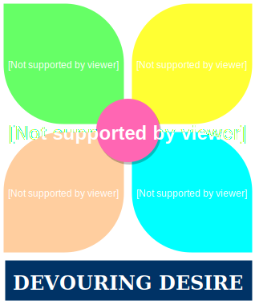
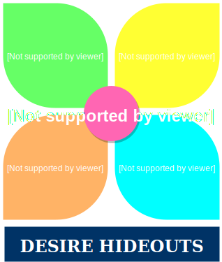
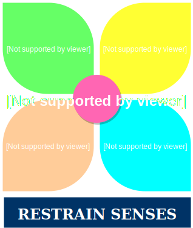
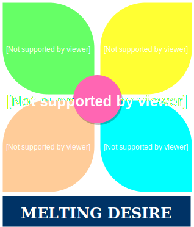

SHLOKAS 3.36 TO 3.43  |  SYNOPSIS - WORLDLY SELFISH DESIRES AND THEIR DYNAMICS
--|--
  | Why do we sin? We know something that will never help us. But still we continue to pursue that, like a  helpless **`addict`**. **`CHANT` -  https://soundcloud.com/samrat_kar/sets/3-36-why-we-sin**
  | We **`sin because of wordly selfish desires`** we have. Desire for worldly things are like **`DESTRUCTIVE ALL DEVOURING FIRE`**. It burns everything that we have. It dries us up what we acquire and makes us crave for even more things than that we ever needed in the first place. It pushes us into a **`viscious cycle of poverty. A trap!`**. Desires leads to Anger. And Anger burns everything! **`CHANT` -  https://soundcloud.com/samrat_kar/sets/3-37-all-devouring-desire**
  | The worldly **`desire acts as a veil`** that **`obscures the reality - Brahman`**. For some it is like a smoke on fire. For some it is like a dust on the mirror. For some it is like an infant in the womb! **`CHANT` -  https://soundcloud.com/samrat_kar/sets/3-38-the-veil**
  | This worldly desire is like a `**fire that destroys everything**`. This is a powerful and dangerous enemy. **`CHANT` -  https://soundcloud.com/samrat_kar/sets/3-39-insatiable-fire**
  | **`Where the desires stay?`** This worldly desire uses the sense organs - internal and external as **`HIDEOUTS`**. Outward 5 senses - **`Indiryas`**. Inward 5 senses - **`मनो बुद्धि अहम्कार`** - Mind, Intellect and the sense of कर्ता These abodes are **`autonomous`** by themselves and have their own local intelligences. They decide of their own and pull in different directions as the horses of a chariot. **`CHANT` -  https://soundcloud.com/samrat_kar/sets/3-40-desire-hideouts**
  | **`How to keep these desires at bay?`**. The best strategy to keep these desires at bay is to keep these sense organs **`clean`**, and **`stopping them in the level of senses`**. That cleansing can be done by following the 4 paths together - Bhakti Yoga, Karma Yoga, Raja Yoga and Gyana Yoga. **`CHANT` -  https://soundcloud.com/samrat_kar/sets/3-41-restrain-senses**
  | Having put the desires at bay, **`now what?`**. Now **`focus on Atman!`** Because it is the Atman which is real and everything shows up in His Light! The **`Atman lightens up`**, and **`conjures up all the appearances of Names and Forms`** that is **`reflected`** first in the objective world out there, which is lightened up in our senses (internal and external), and then in our own mind, and then that appearance of changing world is reflected in our own intellect. **`CHANT` -  https://soundcloud.com/samrat_kar/sets/3-42-the-hierarchy**
  | When one is focussed and deeply **`mindful and connected to the Atman`** through his own intellect, mind and body, he is able to **`melt away that difficult foe - the worldly desire`**. **`CHANT` -  https://soundcloud.com/samrat_kar/sets/3-43-melting-desire**    |
